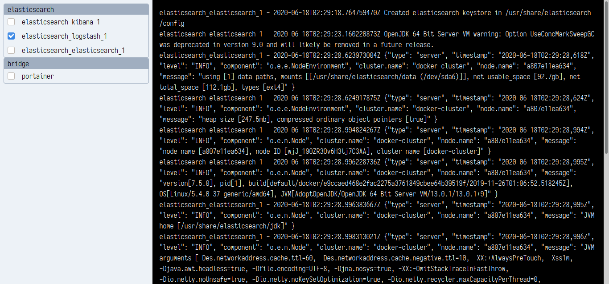

# Stormy Trail

A tool to help developers working with containers.

# Description

It shows all the running containers and allow to select the ones of interest
to get all their logs in the same interface.



It uses Svelte for UI, Tailwind CSS, Fastify instead of express and RxJS to manage the events.

# How to run it

```
yarn run dev
```